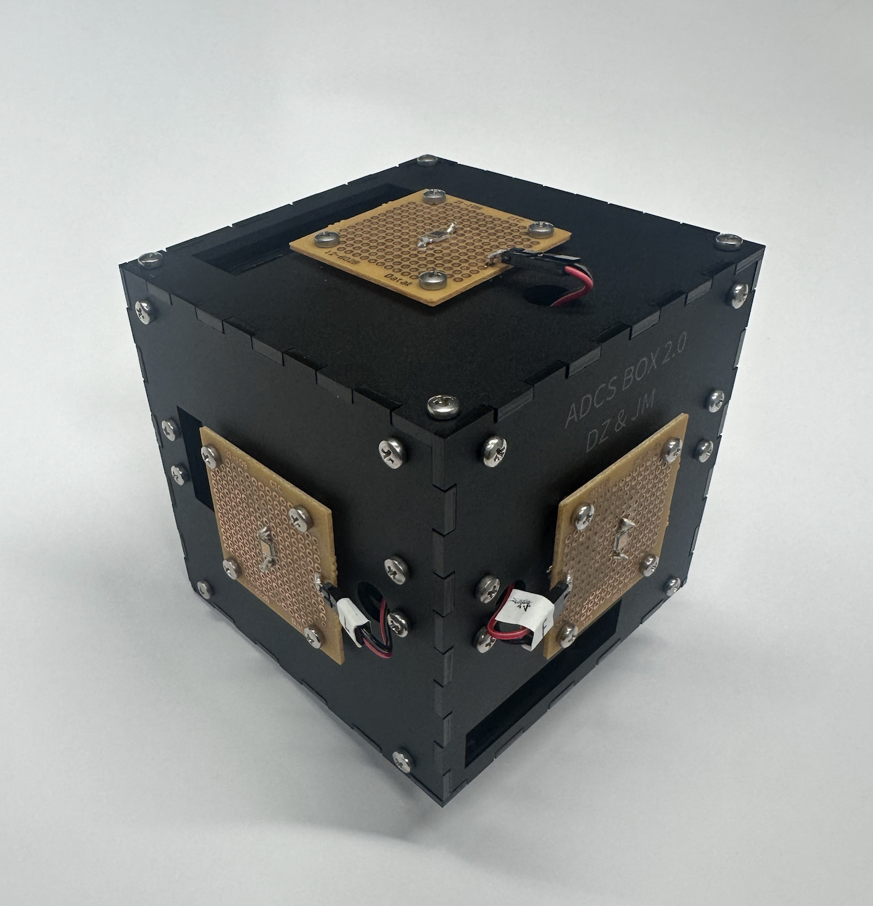

https://cubesat.cooper.edu

The InkSat, our current project, aims to explore the effectiveness of e-paper as a potential thermal controller for small satellites. 
E-paper is an electronic display that consists of a film filled with a clear fluid and charged ink particles. When a charge is applied to the film, it will attract or repel the charged particles accordingly, raising or repelling the pigment to the surface of the film where it remains until another charge is applied. When the pattern shown on the screen is not being changed, it draws nearly zero current. 

My role in this project lies in the ADCS team, where we work on the system to determine and control the attitude and position of the satellite in orbit. 
Our system uses six photodiodes to track sunlight, a magnetometer for Earth's magnetic field, and an IMU for motion data, all connected to a Raspberry Pi 4B. We process these measurements using the TRIAD algorithm and a MEKF to achieve <5° accuracy in attitude estimation

